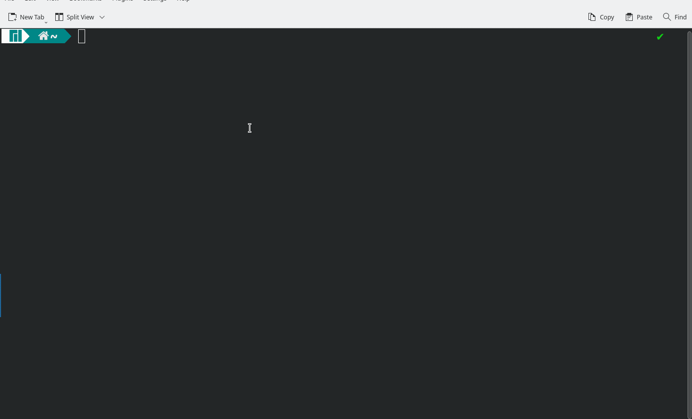

# Projeto teste para Station One
> Para ver o que foi possível ser entregue até a data limite do projeto (30/07) siga para a [branch main](https://github.com/jlucsx/StationOne-FirstProject-MovieAPIManagement/)
## Os Endpoints são:
- `/api/movies/` para a listagem de filmes
- `/api/movies/{id}/`, onde {id} é um int64, para consultar um filme por seu id
- `/api/movies/add` para adicionar um filme ao serviço.

### Para rodar o projeto é necessário:
- Ter Docker Desktop ou Docker Engine+Docker Compose instalados
- clonar este projeto
  - `git clone https://github.com/jlucsx/StationOne-FirstProject-MovieAPIManagement.git`
- dentro da pasta do projeto `cd StationOne-FirstProject-MovieAPIManagement`:
  - no terminal, basta executar um `docker-compose up -d`
    - pode ser necessário executar com direitos de administrador;
    - a flag -d é opcional (isso apenas faz com que o container execute em background).
- para acessar a página demo, basta ir para `http://localhost:5000`

#### Demo

