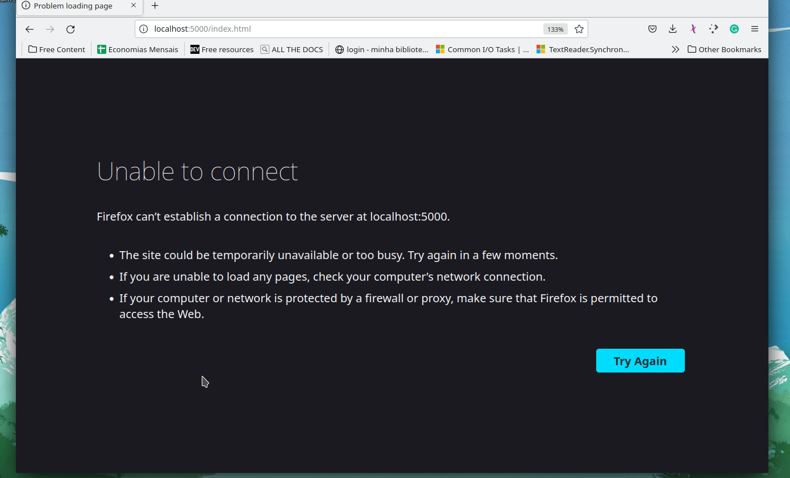

# Projeto teste para Station One
## Os Endpoints são:
- `/api/movies/` para a listagem de filmes
- `/api/movies/{id}/`, onde {id} é um int64, para consultar um filme por seu id
- `/api/movies/add` para adicionar um filme ao serviço.

### Para rodar o projeto é necessário:
- instalar o [.NET 6 SDK](https://dotnet.microsoft.com/en-us/download/dotnet/6.0) mais recente.
- clonar este projeto
  - `git clone https://github.com/jlucsx/StationOne-FirstProject-MovieAPIManagement.git`
- dentro da pasta do projeto
  - no terminal, basta executar um `dotnet run`
- para acessar a página demo, basta ir para `/index.html`

#### Demo

